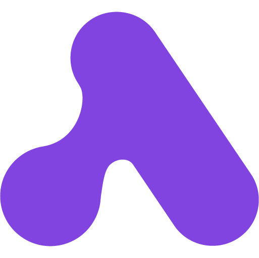

[![Github Release][github-release]](https://github.com/activepieces/activepieces/releases/tag/0.62.0)
![Release Date][release-date]
[![GitHub Stars][github-stars]](https://github.com/activepieces/activepieces/)

<h1>

[Activepieces](docker-compose.yml)

</h1>

### _Powerful AI Agents Anyone Can Build_

## [Features](#top) ✨

Activepieces is a relatively new no-code workflow automation tool that allows users to set up workflows to streamline repetitive tasks. This Activepieces review will provide an in-depth look at the platform's features, use cases, pricing, support, and more to help you determine if it's the right automation solution for your needs.

## [Resources](#top) 📖

* **Website:** https://www.activepieces.com/
* **Repository:** https://github.com/activepieces/activepieces

[`^ Top`](#top)

[github-release]: https://img.shields.io/github/v/release/activepieces/activepieces?style=flat-square&labelColor=31383f
[release-date]: https://img.shields.io/github/release-date/activepieces/activepieces?style=flat-square&labelColor=31383f
[github-stars]: https://img.shields.io/github/stars/activepieces/activepieces
